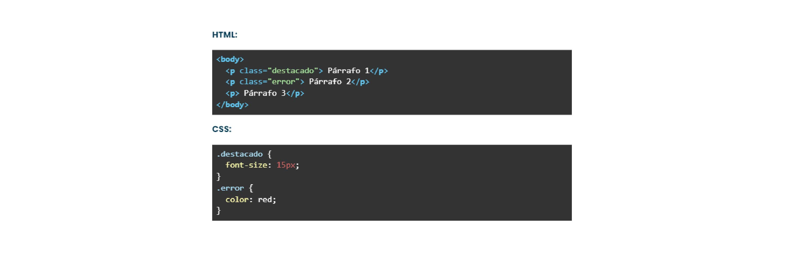
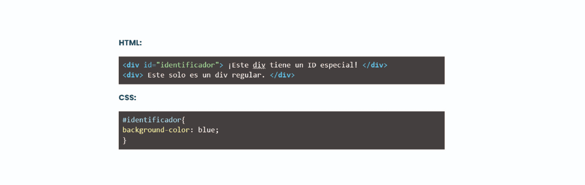
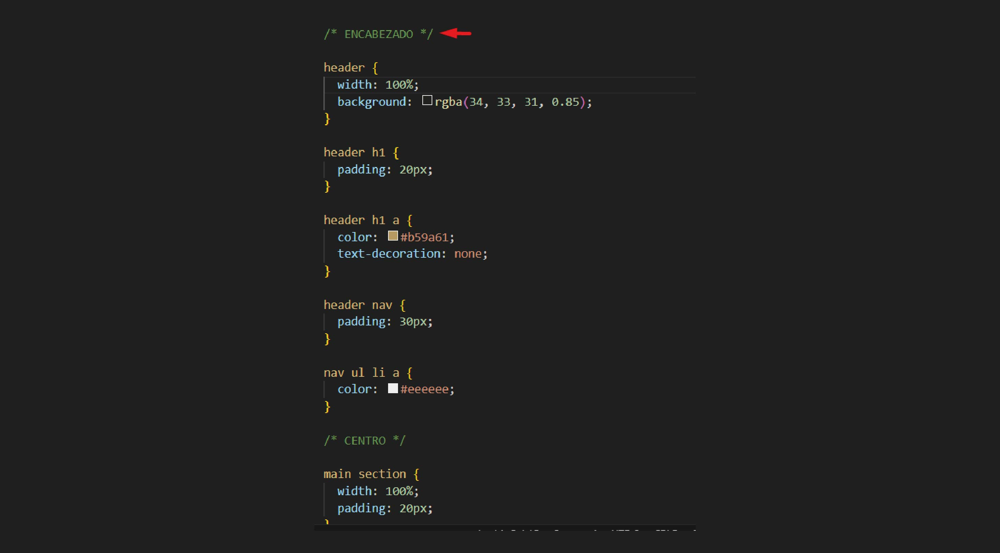

# 🏠 Paso 10 - ¡Introducción a selectores en CSS!


## 👋 ¡Bienvenido a tu siguiente paso! 
¡Hola! Seguimos avanzando 👟

En los pasos previos comenzamos a ver cómo el CSS cambia sustancialmente el estilo de nuestra página web. 

Ahora bien, hasta el momento sólo vimos cómo aplicar CSS a selectores de etiqueta de HTML como header, footer, section, main, img, div, etc. 

Pero ¿Qué pasa si queremos aplicar un estilo diferente a cada div, imagen o section?, bueno para ello existen los selectores de id o clase. 

¡No se asusten! Esto no es más que ponerle un nombre al elemento HTML para luego aplicar un CSS específico a cada uno. 

CLASES

En HTML la escribimos de la siguiente manera: <p class=”destacado”>Párrafo 1</p>

En CSS vamos a usar un punto (.)  y quedaría así: .destacado {font-size: 15px;}

Por ejemplo:


Esto quiere decir entonces que, el párrafo 1 tendrá un tamaño de fuente de 15px y el párrafo 2 será de color rojo. 

## ID

En HTML la escribimos de la siguiente manera: <div id=”identificador”>Contenido 1</div>

En CSS vamos a usar un numeral (#)  y quedaría así: #identificador {background-color: blue;}

Por ejemplo:


Esto quiere decir entonces que, ese div tendrá de color de fondo el color azul. 

¿Listo? ¡Vamos! 🚀

## 📖 Material descargable

Aquí es donde encontrarás el material descargable que complementará los ejercicios prácticos que vamos a ver en los siguientes pasos. 

Para tu primer encuentro en vivo tienes que leer solo el material que te compartimos a continuación 👉 Selectores en CSS


📢 ¡Importante!

* No debes memorizar, concéntrate en entender el concepto. La práctica hará que luego puedas aplicarlo con más agilidad.

Si hay algo que no comprendes, ¡no te preocupes! Anótalo y pregunta a tus compañeros en el encuentro en vivo.

✍️ Para tu próximo encuentro en vivo
En esta ocasión te vamos a pedir que puedas ver el siguiente video sobre selectores de ID y Clases en CSS. ¡Vamos a usarlo para practicar en los próximos pasos!: 
https://youtu.be/1hD1UFPr4KU

✅ Checklist
Asegúrate de:

Entender la diferencia entre selector de id, clase y de etiqueta

Leer el material de tu próxima clase.

💡 Revisar estos puntos es muy importante dado que ayudarán a que todos puedan tener la mejor experiencia posible y logren resolver los desafíos correspondientes.

Si queres colaborar o sugerir algun cambio en este paso, hacelo 👉 aquí.

# 👣 Paso 11 - ¡A trabajar en equipo!


##  ¡Bienvenido a tu siguiente paso! 
Llegó el momento de aplicar estilos CSS con selectores de id y clase. 

🛑✋ Momento, antes de continuar, validen: ¿todos vieron el video sobre selectores de id o clase? Si no es así, tómense el tiempo de realizar este paso y sacarse las dudas porque ¡lo vamos a necesitar!. Si encuentran alguna dificultad, recuerden que pueden llamar al mentor para sacarse las dudas. 

¡Continuemos! 🚀

Antes de pasar de lleno a la práctica, hay un concepto muy importante tanto en HTML como en CSS que tiene que ver con las relaciones de parentesco entre los elementos, padres e hijos. ¿Es decir que hay un árbol genealógico en programación? Algo así!

Vean el siguiente video para entender más sobre estas relaciones: 
https://youtu.be/GGn9UCdoj6M

💡 Para este paso, les vamos a pedir que:

🔸Resuelvan individualmente el ejercicio en su propia computadora.

🔸Preguntar a tus compañeros en caso de no entender alguna parte. 

🔸Si no logran resolver algo entre todos, no olviden llamar al mentor para que los ayude. 

📌 ¡Recuerden mantener las cámaras encendidas en todo el proceso! ¡Sé protagonista de tus objetivos!

## ✏️ Actividad - Aplicando estilos CSS
Para realizar este ejercicio vamos a volver a posicionarnos en la web que venimos armando y pensar qué aspecto quiero que tenga la misma, elegir los colores, cómo van a lucir los links, los títulos y los textos. El encabezado y el footer, ¿van a tener los mismos colores o diferentes? 

💡Tip: Te recomendamos realizar comentarios en CSS para ir dividiendo las secciones. De esta manera será más fácil entender qué sección estás modificando. 


⚒️ ¡Manos a la obra diseñando nuestra web!

Sigue estos pasos, en tu compu: 

1. Coloca un color de fondo para el header y establece su ancho en 100%

2. Coloca un color de fondo para el footer y establece su ancho en 100%

3. Coloca un color de fondo para tu sección principal y establece su ancho en 100%

4. Coloca el siguiente código en tu hoja de estilo CSS (arriba de todo)
```
* {
  padding: 0;
  margin: 0;
  box-sizing: border-box;
  text-decoration: none;
  list-style-type: none;
}
```

💡Este código lo que hace es “resetar estilos” y aplicarlo en toda la web. Es una buena práctica colocarlo en tus proyectos apenas comenzás. Te explicamos qué hace cada una de estas líneas

margin: 0; → Coloca todos los márgenes de los elementos del sitio en cero

padding: 0; → Coloca todos los márgenes internos de los elementos del sitio en cero

box-sizing → indica cómo se deben calcular las medidas de un elemento. El valor border-box en el box-sizing hace que el padding y el border pasen a formar parte del cálculo del ancho de la caja y no lo suman posteriormente. Si coloco que el ancho de un elemento es de 250px, me respetará ese ancho aunque el elemento tenga borde o padding. 

text-decoration: none; → Elimina el subrayado de los elementos que lo contengan (por ejemplo los que son links)

list-style-type: none; → Elimina los estilos de los elementos de lista <li>. En el caso de las listas desordenadas, elimina los puntitos. 

5. Vamos a probar la reutilización de clases. Para ello crea 3 estilos de css para fuentes y establece el color de la tipografía. 

Por ejemplo:

.fuente-clara {color: #eeeeee;}

.fuente-oscura {color: #22211f;}

.fuente-acento {color: #b59a61;}

Ahora, a los elementos que estén sobre fondo claro, colócales la clase de fuente-oscura (para que contraste), a los elementos sobre fondo oscuro,  colócales la clase de fuente-clara y revisa si puede haber elementos, cómo títulos que requieran de un color especial y colócalas la clase de fuente-acento

6. Coloca un ancho de 100% a la imagen del carrusel 

7. Revisa si necesitas agregar padding o margin a algún elemento para dar más aire y que se vea más armonioso. 


💡 Cuando todos hayan logrado seguir las instrucciones, de a uno vayan compartiendo pantalla mostrando su código y el resultado de su CSS.


➕ Referencia de cómo debería verse la estructura del sitio

A continuación les dejamos un video para ver cómo va quedando la web. 
https://youtu.be/n5p5qHsfuF0

✨ Ejercicio complementario: 

Como ejercicio complementario, les pedimos que intenten agregar un color de texto diferente al pasar el mouse sobre el menú de navegación. 

💡Tip: Para ello tenemos que utilizar pseudo clases, las cuales se utilizan para aplicar estilos específicos a elementos HTML en ciertos estados o situaciones. Por ejemplo a:hover (encontrarán más información sobre este punto en la teoría)

✅ Checklist
Asegúrate de:

Realizar los cambios necesarios en tu sitio web en base a los puntos mencionados anteriormente.

Revisar la diferencia entre selectores de clase, de id, y de etiquetas 

Dejar tu sitio listo para lo que se viene!!

💡 Revisar estos puntos es muy importante dado que ayudarán a que todos puedan tener la mejor experiencia posible y logren resolver los desafíos correspondientes. 

Si queres colaborar o sugerir algun cambio en este paso, hacelo 👉 aquí.

# 👣 Paso 12 - ¡Seguimos con CSS!

## 👋 ¡Bienvenido a tu siguiente paso! 
🛑✋ Momento, antes de continuar, validen: ¿todos pudieron aplicar estilos con selectores en su página? Si no es así, tómense el tiempo de realizar este paso y sacarse las dudas porque ¡lo vamos a necesitar!. Si encuentran alguna dificultad, recuerden que pueden llamar al mentor para sacarse las dudas. 

Ahora vamos a continuar agregando contenido y diseñando nuestro sitio. 

¡Continuemos! 🚀

💡 Para este paso, les vamos a pedir que:

🔸Resuelvan individualmente el ejercicio en su propia computadora.

🔸Preguntar a tus compañeros en caso de no entender alguna parte. 

🔸Si no logran resolver algo entre todos, no olviden llamar al mentor para que los ayude. 

📌 ¡Recuerden mantener las cámaras encendidas en todo el proceso! ¡Sé protagonista de tus objetivos!

✏️ Actividad - Continuamos armando nuestro sitio
Aprovechemos lo aprendido hasta acá sobre html y css para continuar agregando contenido a nuestra página web. 

Tomando como referencia la web que vimos https://www.minicarbono.com/ les proponemos replicar el siguiente diseño en su web, tanto el HTML como el CSS:


## ¿Qué pueden colocar en estas tarjetas?

Si tienes trabajos previos realizados, puedes poner una imagen de estos proyectos con su título, texto y detalle. Sino, puedes imaginar qué proyectos quisieras crear a futuro o colocar ciertos gustos como comida preferida o peli! Dejen volar su imaginación! ☁️

💡 Recuerden que existen muchas propiedades de CSS que podemos aplicar, entre ellas el border-radius (que usamos por ejemplo para redondear el borde de la imagen). Pueden ver más sobre esta propiedad en el siguiente link 👉border-radius 

📌 Para tener en cuenta: el estilo de las cajas es igual en ambas. Se componen de una imagen, un título, una descripción y un botón de saber más. ¿Cómo harían para reutilizar el estilo y no tener que escribirlo más de una vez en css?


➕ Referencia de cómo debería verse la estructura del sitio


✅ Checklist
Asegúrate de:

Darle estilo a tu web

Crear nuevos elementos que la completen

💡 Revisar estos puntos es muy importante dado que ayudarán a que todos puedan tener la mejor experiencia posible y logren resolver los desafíos correspondientes.

🔎 Resumen y buenas prácticas aprendidas
Además de los selectores de etiqueta existen los selectores de clases y de Ids

En HTML y CSS el orden de los elementos tiene un orden de jerarquía de padres a hijos

Al momento de aplicar estilos existe una jerarquía en la que la clase de id es prioritaria.

📓 Test

Por último, te proponemos realizar un muy breve test para poner a prueba los aprendizajes alcanzados. Vamos 🚀

📝 Realizar test
https://eggeducacion.typeform.com/to/GnjSBGga#form_type=autoevaluacion&profile_id=65124ef5f615c80f596b9c98&step_id=7iWqvxUYl077Od4p4emu9A&module_id=1aVJePrGRBrkp5WrfPIzbW&section_id=7kiTtFyDMPcT80wYiQIfD7

⏭️ En el próximo encuentro cómo organizar elementos en el espacio de la página web utilizando CSS. Si queres colaborar o sugerir algun cambio en este paso, hacelo 👉 aquí.


